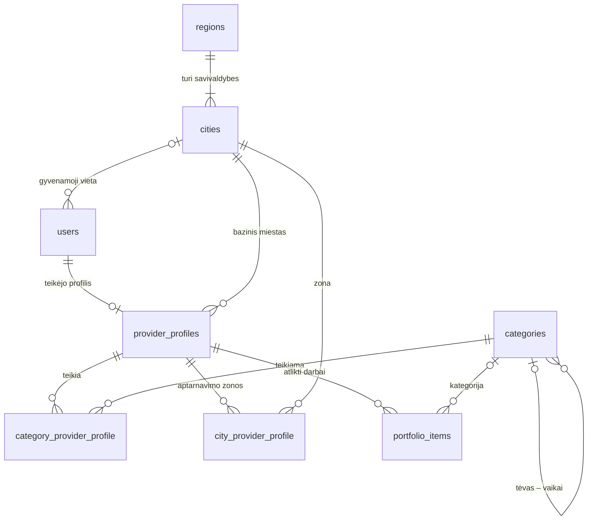
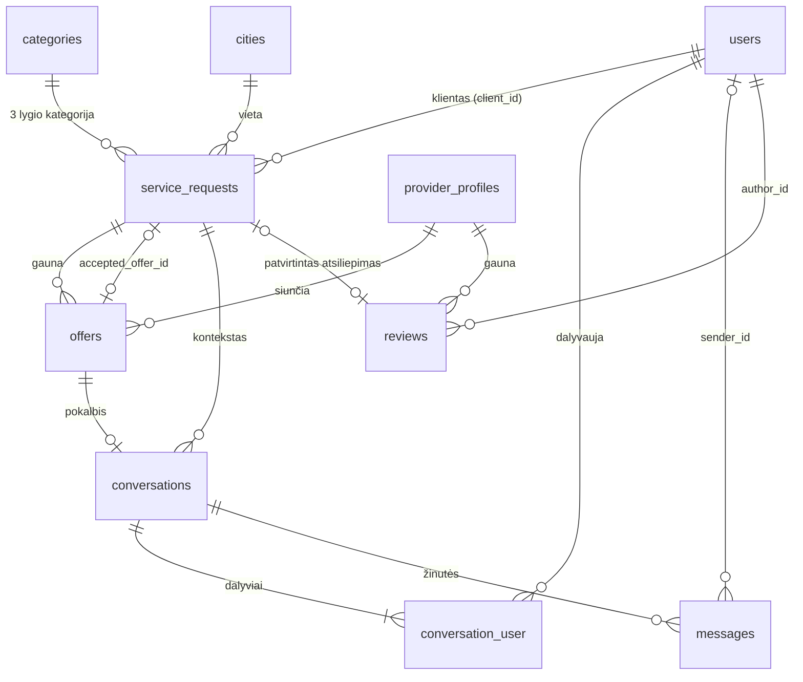
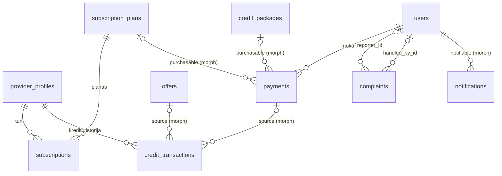

# Duomenų bazės schema

> **Etapas 0 · būsena: projektas, laukia vartotojo patvirtinimo.**
> Kodo dar nėra: migracijas pagal šį dokumentą rašysim Etape 2. Patvirtinus schemą, kiekvienas jos
> pakeitimas daromas atskiru commit'u su paaiškinimu.

## Turinys

1. [Kaip skaityti šį dokumentą](#1-kaip-skaityti-šį-dokumentą)
2. [Svarbiausi sprendimai ir alternatyvos](#2-svarbiausi-sprendimai-ir-alternatyvos)
3. [ER diagramos](#3-er-diagramos)
4. [Lentelės](#4-lentelės)
5. [Laravel standartinės lentelės](#5-laravel-standartinės-lentelės)
6. [PHP enum'ai (rolės ir statusai)](#6-php-enumai-rolės-ir-statusai)
7. [Migracijų eiliškumas](#7-migracijų-eiliškumas)
8. [Dažniausios užklausos → kurį indeksą naudoja](#8-dažniausios-užklausos--kurį-indeksą-naudoja)
9. [Ko sąmoningai kol kas nededam](#9-ko-sąmoningai-kol-kas-nededam)

---

## 1. Kaip skaityti šį dokumentą

### Laravel sąvokos šiame dokumente

| Sąvoka                   | Paprastai                                                                                                                                                        | Dokumentacija                                                    |
| ------------------------ | ---------------------------------------------------------------------------------------------------------------------------------------------------------------- | ---------------------------------------------------------------- |
| **Migracija**            | PHP klasė, aprašanti lentelės sukūrimą ar pakeitimą. DB schema versijuojama per Git kaip ir kodas (WordPress analogas – `dbDelta()`, tik su atšaukimu `down()`). | https://laravel.com/docs/13.x/migrations                         |
| **Eloquent modelis**     | PHP klasė vienai lentelei: `ServiceRequest` ↔ `service_requests`.                                                                                                | https://laravel.com/docs/13.x/eloquent                           |
| **Eloquent ryšys**       | Modelio metodas, kuris grąžina susijusius įrašus: `$request->offers`.                                                                                            | https://laravel.com/docs/13.x/eloquent-relationships             |
| **Indeksas**             | Papildoma surikiuota struktūra (B-medis), padedanti DB rasti eilutes nenuskaitant visos lentelės.                                                                | https://laravel.com/docs/13.x/migrations#indexes                 |
| **Išorinis raktas (FK)** | Stulpelis, rodantis į kitos lentelės `id`. DB pati saugo, kad nuoroda būtų teisinga.                                                                             | https://laravel.com/docs/13.x/migrations#foreign-key-constraints |

### Žymėjimai lentelėse

| Žymėjimas                                          | Reiškia                                                   | Laravel migracijoje                                                 |
| -------------------------------------------------- | --------------------------------------------------------- | ------------------------------------------------------------------- |
| `id`                                               | BIGINT UNSIGNED AUTO_INCREMENT, pirminis raktas           | `$table->id()`                                                      |
| `FK → users`                                       | išorinis raktas į `users.id`                              | `$table->foreignId('client_id')->constrained('users')`              |
| `?` po tipu                                        | leidžiamas NULL                                           | `->nullable()`                                                      |
| `= x`                                              | numatytoji reikšmė                                        | `->default(x)`                                                      |
| `string(n)`                                        | VARCHAR(n)                                                | `$table->string('name', n)`                                         |
| `text`                                             | ilgas tekstas                                             | `$table->text('description')`                                       |
| `uint`, `usmallint`, `utinyint`, `ubigint`         | sveikieji be ženklo                                       | `unsignedInteger()`, `unsignedSmallInteger()`…                      |
| `int`                                              | sveikasis su ženklu (gali būti neigiamas)                 | `integer()`                                                         |
| `bool`                                             | TINYINT(1)                                                | `boolean()`                                                         |
| `decimal(p,s)`                                     | tikslus dešimtainis                                       | `decimal('rating_avg', 3, 2)`                                       |
| `json`                                             | JSON (SQLite – TEXT)                                      | `json()`                                                            |
| `timestamp`, `date`                                | data ir laikas / tik data                                 | `timestamp()`, `date()`                                             |
| `timestamps`                                       | `created_at` + `updated_at`                               | `$table->timestamps()`                                              |
| `softDeletes`                                      | `deleted_at`                                              | `$table->softDeletes()`                                             |
| `morphs(x)`                                        | `x_type` + `x_id` + indeksas abiem                        | `$table->morphs('reportable')`                                      |
| **ON DELETE**: `cascade` / `restrict` / `set null` | ištrinti kartu / neleisti trinti tėvo / nunulinti nuorodą | `->cascadeOnDelete()` / `->restrictOnDelete()` / `->nullOnDelete()` |

---

## 2. Svarbiausi sprendimai ir alternatyvos

### 2.1 Rolės: `users.role` + atskira `provider_profiles` lentelė

**Pasirinkta:** stulpelis `users.role` (`client` | `provider` | `admin`). Teikėjo duomenys laikomi atskiroje
`provider_profiles` lentelėje (ryšys 1:1).

| Alternatyva                                                                | Kada verta                                                 | Kodėl ne dabar                                                                        |
| -------------------------------------------------------------------------- | ---------------------------------------------------------- | ------------------------------------------------------------------------------------- |
| Paketas `spatie/laravel-permission` (lentelės roles, permissions)          | kai reikia smulkių admin teisių (moderatorius, buhalteris) | 3 fiksuotoms rolėms per sudėtinga. Pridėti galėsim vėliau, `role` logikos nekeisdami. |
| Atskiros `clients` ir `providers` lentelės, kiekviena su savo prisijungimu | kai rolės visiškai skirtingos                              | dvigubas autentifikavimas, du „guard'ai", dubliuotas kodas                            |
| Kelios rolės vienam vartotojui (pivot lentelė)                             | kai tas pats žmogus ir užsako, ir teikia paslaugas         | pirmai versijai (MVP) taisyklė „viena paskyra = viena rolė". Praplėsti galima vėliau. |

**Kodėl teikėjo duomenys atskirai:** ~75 % vartotojų yra klientai, ir jiems teikėjo laukai nereikalingi. Taip
`users` lieka švari, o teikėjo duomenys (aprašymas, reitingas, kreditai) keičiasi savo ritmu.

### 2.2 Kategorijų medis (3 lygiai): adjacency list + cache

**Pasirinkta:** `categories.parent_id` (nuoroda į tėvą) + `depth` (1–3). Visas medis laikomas cache.

| Alternatyva                                     | +                                  | −                                             |
| ----------------------------------------------- | ---------------------------------- | --------------------------------------------- |
| Nested set (paketas `kalnoy/laravel-nestedset`) | labai greitai nuskaito visą pomedį | įrašymas sudėtingas, medį lengva „sugadinti"  |
| Materialized path (`path = "1/12/130"`)         | pomedis paprastu `LIKE '1/12/%'`   | perkeliant kategoriją reikia perrašyti kelius |
| Closure table (atskira protėvių lentelė)        | lankstu bet kokiam gyliui          | papildoma lentelė, sudėtingiausias variantas  |

**Kodėl:** lygių tik 3, kategorijų ~550. Visą medį pigiau laikyti cache (`Cache::rememberForever`), o protėvius
ir vaikus rasti PHP'e.

**Taisyklės:**

- Užklausa visada priskiriama **3 lygio** kategorijai.
- Teikėjas gali pasirinkti **bet kurį lygį**. Pasirinktas 2 lygis reiškia „visi jo vaikai".
- Atitikimas: užklausos kategorijai X teikėjai ieškomi pagal `category_id IN (X, X tėvas, X senelis)`.

Pavyzdys: `Statyba ir remontas` (1) → `Apdailos darbai` (2) → `Plytelių klijavimas` (3).

### 2.3 Geografija: apskritys → savivaldybės + teikėjo zonos

**Pasirinkta:** `regions` (10 apskričių) → `cities` (60 savivaldybių, pvz. „Vilnius", „Vilniaus r.").
Teikėjo **aptarnavimo zonos** = savivaldybių sąrašas (pivot `city_provider_profile`) + vėliavėlė „visa Lietuva".

| Alternatyva                     | Kodėl ne                                                                       |
| ------------------------------- | ------------------------------------------------------------------------------ |
| Tik ~100 miestų                 | neapima rajonų ir kaimų, o daug užsakymų būna būtent priemiesčiuose            |
| Visos ~20 000 gyvenviečių       | per daug, sudėtingas pasirinkimas, nereikalingas tikslumas                     |
| Spindulys km nuo bazinio miesto | teikėjui sunkiau suprasti. Koordinates jau saugom, tad pridėti galėsim vėliau. |

**Kodėl savivaldybės:** bet kuris Lietuvos adresas priklauso lygiai vienai savivaldybei, todėl paieška ir
atitikimas veikia visada. Lentelę vadinam `cities` paprastumo dėlei, o UI rodom „Miestas / rajonas".

### 2.4 Pavadinimai, kurių vengiam

| Vengiam            | Kodėl                                          | Naudojam           |
| ------------------ | ---------------------------------------------- | ------------------ |
| `jobs` lentelė     | jau užimta Laravel eilių (queue)               | `service_requests` |
| `Request` modelis  | painiotųsi su `Illuminate\Http\Request`        | `ServiceRequest`   |
| `Provider` modelis | painiotųsi su `App\Providers\*ServiceProvider` | `ProviderProfile`  |

### 2.5 Į ką rodo FK: `users` ar `provider_profiles`?

- **Teikėjo verslo duomenys** (kategorijos, zonos, portfolio, pasiūlymai, atsiliepimai, kreditai, prenumeratos)
  rodo į `provider_profile_id`.
- **Žmogaus veiksmai** (užklausos kūrimas, žinutės, mokėjimai, skundai, pranešimai) rodo į `users.id`.

Taip `User` modelis neapauga teikėjo ryšiais, o `ProviderProfile` tampa aiškia teikėjo esybe.
Patogumui yra `User::offers()` – `hasManyThrough` ryšys per `ProviderProfile`.

### 2.6 Statusai: `string` + PHP enum (ne MySQL `ENUM`)

- MySQL `ENUM` keitimas reikalauja `ALTER TABLE`, o didelėje lentelėje tai lėta ir rizikinga.
- SQLite `ENUM` tipo neturi.
- PHP backed enum duoda tipų saugumą, lietuvišką pavadinimą (metodas `label()`) ir Eloquent cast'ą.

→ https://laravel.com/docs/13.x/eloquent-mutators#enum-casting

### 2.7 Pinigai – sveikais centais

`price_cents = 2490` reiškia 24,90 €. `float` negali tiksliai saugoti 0,1 (`0.1 + 0.2 ≠ 0.3`). `decimal` irgi
tiktų, bet centais paprasčiausia skaičiuoti, ir taip pinigus siunčia mokėjimų sistemos (Paysera, Stripe).
Visų pinigų stulpelių pavadinimai baigiasi `_cents`, valiuta – EUR.

### 2.8 Kreditai – „didžiosios knygos" (ledger) šablonas

- Kiekvienas kreditų pokytis įrašomas kaip **nauja, nekeičiama eilutė** `credit_transactions` lentelėje
  (+ pirkimas, − pasiūlymas, + grąžinimas).
- `provider_profiles.credits_balance` – tik greitas cache. Jis visada lygus `SUM(amount)`.
- Balansas keičiamas tik `DB::transaction()` viduje, su `lockForUpdate()`. Taip du vienu metu siunčiami
  pasiūlymai negali nurašyti daugiau kreditų, nei teikėjas turi.

→ https://laravel.com/docs/13.x/database#database-transactions ·
https://laravel.com/docs/13.x/queries#pessimistic-locking

### 2.9 Failai – `spatie/laravel-medialibrary`

Visi failai laikomi vienoje polimorfinėje `media` lentelėje: avatarai, logotipai, portfolio, užklausų nuotraukos,
žinučių priedai, skundų įrodymai. Paketas pats daro miniatiūras (conversions), o Filament turi oficialų jo įskiepį.
Alternatyva būtų atskiros `portfolio_images`, `request_photos`… lentelės: daugiau lentelių, o miniatiūras
reikėtų daryti pačiam. → https://spatie.be/docs/laravel-medialibrary

### 2.10 Denormalizuoti skaitliukai

| Laukas                                          | Skaičiuojamas iš                 | Kada atnaujinam                                  |
| ----------------------------------------------- | -------------------------------- | ------------------------------------------------ |
| `provider_profiles.rating_avg`, `reviews_count` | `reviews` (tik `published`)      | atsiliepimą sukūrus ar paslėpus (observer → job) |
| `provider_profiles.completed_jobs_count`        | `service_requests` (`completed`) | užbaigus užklausą                                |
| `provider_profiles.credits_balance`             | `credit_transactions`            | toje pačioje DB transakcijoje                    |
| `service_requests.offers_count`                 | `offers`                         | sukūrus ar atšaukus pasiūlymą                    |
| `conversations.last_message_at`                 | `messages`                       | gavus naują žinutę                               |

**Kodėl:** rikiuojant katalogą pagal reitingą, kiekvienam puslapio atidarymui skaičiuoti `AVG()` per 100 000
atsiliepimų būtų lėta. WordPress daro tą patį su `wp_posts.comment_count`.
**Kaina:** skaitliukus reikia nepamiršti atnaujinti. Todėl Etape 2 bus testas „skaitliukai sutampa su realiais".

### 2.11 Soft deletes

`users`, `provider_profiles`, `service_requests` ir `messages` naudoja soft deletes: įrašas pažymimas
`deleted_at`, todėl istorija lieka ir įrašą galima atkurti (WordPress analogas – „Šiukšliadėžė").
Kitose lentelėse naudojam statusus (pvz. `reviews.status = hidden`).
Vartotojo ištrynimas pagal BDAR = **anonimizavimas**: vardas tampa „Ištrintas vartotojas", el. paštas –
`deleted-{id}@example.invalid`. → https://laravel.com/docs/13.x/eloquent#soft-deleting

### 2.12 ON DELETE taisyklės

| Taisyklė   | Kur naudojam                                                                                                                                                  | Kodėl                                                         |
| ---------- | ------------------------------------------------------------------------------------------------------------------------------------------------------------- | ------------------------------------------------------------- |
| `cascade`  | pivot lentelės, portfolio, pokalbio dalyviai ir žinutės, užklausos pasiūlymai                                                                                 | be tėvo vaikas neturi prasmės                                 |
| `restrict` | finansai (`payments`, `credit_transactions`, `subscriptions`), užklausos kategorija ir miestas, atsiliepimo autorius                                          | negalima netyčia ištrinti istorijos ar naudojamo žinyno įrašo |
| `set null` | neprivalomos nuorodos: `users.city_id`, `portfolio_items.category_id`, `messages.sender_id`, `complaints.handled_by_id`, `service_requests.accepted_offer_id` | įrašas lieka, tik be nuorodos                                 |

`users` ir `service_requests` naudoja soft deletes, todėl tikras `DELETE` vyksta retai. Šios taisyklės yra saugiklis.

### 2.13 Morph map (polimorfiniai tipai)

Polimorfiniuose stulpeliuose (`*_type`) saugom trumpus vardus (`offer`, `review`), o ne `App\Models\Offer`.
Tai nustatoma `Relation::enforceMorphMap()` metodu `AppServiceProvider` klasėje. Perkėlus klasę į kitą
namespace, duomenų DB keisti nereikės.
→ https://laravel.com/docs/13.x/eloquent-relationships#custom-polymorphic-types

---

## 3. ER diagramos

> GitHub šias Mermaid diagramas rodo kaip paveikslėlius.
> Žymėjimas: `||` – lygiai vienas, `|o` – nulis arba vienas, `o{` – nulis arba daug, `|{` – vienas arba daug.

### 3.1 Vartotojai, geografija, katalogas, teikėjai



### 3.2 Užklausos, pasiūlymai, žinutės, atsiliepimai



### 3.3 Monetizacija, moderavimas, pranešimai



---

## 4. Lentelės

Grupės: **A** vartotojai · **B** geografija · **C** katalogas · **D** teikėjai · **E** užklausos ir pasiūlymai ·
**F** komunikacija · **G** atsiliepimai · **H** monetizacija · **I** moderavimas, pranešimai, failai.

### A. Vartotojai

#### `users`

**Paskirtis:** visi prisijungiantys žmonės – klientai, teikėjai, administratoriai. Pagrindas – Laravel
numatytoji `users` migracija, kurią papildom.

| Stulpelis             | Tipas                       | Pastaba                                                            |
| --------------------- | --------------------------- | ------------------------------------------------------------------ |
| id                    | `id`                        |                                                                    |
| role                  | `string(20)` = `client`     | enum `UserRole`                                                    |
| first_name            | `string(60)`                |                                                                    |
| last_name             | `string(80)`                | viešai rodoma tik pirma raidė: „Jonas P." (accessor `public_name`) |
| email                 | `string` UNIQUE             | prisijungimas                                                      |
| email_verified_at     | `timestamp?`                | Laravel el. pašto patvirtinimas                                    |
| phone                 | `string(20)?`               | E.164 formatas: `+3706…`                                           |
| password              | `string`                    | hash (bcrypt)                                                      |
| city_id               | `FK → cities ?`, set null   | numatytasis miestas formoms                                        |
| notification_settings | `json?`                     | pvz. `{"new_requests":"instant","messages_email":true}`            |
| last_seen_at          | `timestamp?`                | „buvo prisijungęs prieš 5 min."                                    |
| banned_at             | `timestamp?`                | NULL = aktyvus                                                     |
| ban_reason            | `string?`                   |                                                                    |
| remember_token        | `string(100)?`              | „Prisiminti mane"                                                  |
|                       | `timestamps`, `softDeletes` |                                                                    |

**Ryšiai:** `hasOne` ProviderProfile · `hasMany` ServiceRequest (`client_id`) · `belongsTo` City ·
`belongsToMany` Conversation (per `conversation_user`) · `hasMany` Message (`sender_id`), Review (`author_id`),
Payment, Complaint (`reporter_id`) · `morphMany` notifications (trait `Notifiable`) ·
`hasManyThrough` Offer (per ProviderProfile).

**Indeksai ir kodėl:**

- `UNIQUE(email)` – kiekvienas prisijungimas ieško pagal el. paštą. Unikalumą užtikrina pati DB, todėl dvi
  vienu metu vykstančios registracijos tuo pačiu el. paštu nepraslys (validacija viena to neapsaugo).
- `(role, created_at)` – admin sąrašai, pvz. „naujausi teikėjai". Indeksas vien tik pagal `role` būtų beveik
  nenaudingas: reikšmių tik 3, tad selektyvumas mažas. Kartu su rikiavimo stulpeliu jis leidžia išvengti
  rūšiavimo (filesort).
- `city_id` – indeksą MySQL sukuria automatiškai dėl FK.

---

### B. Geografija

#### `regions`

**Paskirtis:** 10 Lietuvos apskričių – savivaldybių grupavimui ir „visos apskrities" pasirinkimui UI.

| Stulpelis  | Tipas               | Pastaba              |
| ---------- | ------------------- | -------------------- |
| id         | `id`                |                      |
| name       | `string(60)`        | „Vilniaus apskritis" |
| slug       | `string(60)` UNIQUE |                      |
| sort_order | `usmallint` = 0     |                      |

Be `timestamps`: žinyninė lentelė keičiasi itin retai (modelyje `public $timestamps = false;`).
**Ryšiai:** `hasMany` City.
**Indeksai:** `UNIQUE(slug)`. Daugiau nereikia: lentelėje 10 eilučių, ir visa ji laikoma cache.

#### `cities`

**Paskirtis:** 60 savivaldybių (UI rodoma „Miestas / rajonas"): užklausos vieta, teikėjo bazė ir aptarnavimo zonos.

| Stulpelis     | Tipas                    | Pastaba                                                                          |
| ------------- | ------------------------ | -------------------------------------------------------------------------------- |
| id            | `id`                     |                                                                                  |
| region_id     | `FK → regions`, restrict |                                                                                  |
| name          | `string(80)`             | „Vilnius", „Vilniaus r."                                                         |
| name_locative | `string(80)`             | vietininkas SEO antraštėms: „Santechnikai **Vilniuje**", „… **Vilniaus rajone**" |
| slug          | `string(80)` UNIQUE      | `vilnius`, `vilniaus-r`                                                          |
| latitude      | `decimal(10,7)?`         | savivaldybės centras (žemėlapiui, ateityje – atstumui)                           |
| longitude     | `decimal(10,7)?`         |                                                                                  |
| sort_order    | `usmallint` = 0          | didmiesčiai sąrašo viršuje                                                       |

Be `timestamps`.
**Ryšiai:** `belongsTo` Region · `hasMany` User, ProviderProfile (bazinis miestas), ServiceRequest ·
`belongsToMany` ProviderProfile per `city_provider_profile` (zonos).
**Indeksai:** `UNIQUE(slug)` – URL `/meistrai/santechnikai/vilnius`. `region_id` – automatiškai (FK).
Lentelėje 60 eilučių, ir visa ji laikoma cache.

---

### C. Katalogas

#### `categories`

**Paskirtis:** 3 lygių paslaugų medis (~12 / ~80 / ~450).

| Stulpelis          | Tipas                         | Pastaba                                               |
| ------------------ | ----------------------------- | ----------------------------------------------------- |
| id                 | `id`                          |                                                       |
| parent_id          | `FK → categories ?`, restrict | NULL = 1 lygis                                        |
| depth              | `utinyint`                    | 1, 2 arba 3                                           |
| name               | `string(120)`                 |                                                       |
| slug               | `string(140)` UNIQUE          | unikalus visame medyje, kad URL būtų trumpas          |
| description        | `text?`                       |                                                       |
| icon               | `string(60)?`                 | ikonos vardas                                         |
| offer_cost_credits | `utinyint` = 1                | kiek kreditų kainuoja pasiūlymas (naudojama 3 lygyje) |
| sort_order         | `usmallint` = 0               |                                                       |
| is_active          | `bool` = true                 | išjungta kategorija nerodoma, bet nesutrinama         |
| meta_title         | `string(160)?`                | SEO                                                   |
| meta_description   | `string(300)?`                | SEO                                                   |
|                    | `timestamps`                  |                                                       |

**Ryšiai:** `belongsTo` parent (tas pats modelis) · `hasMany` children (tas pats modelis) ·
`belongsToMany` ProviderProfile (su pivot laukais) · `hasMany` ServiceRequest, PortfolioItem.

**Indeksai ir kodėl:**

- `UNIQUE(slug)` – URL `/paslaugos/{slug}` turi atitikti lygiai vieną kategoriją.
- `(parent_id, sort_order)` – užklausa „duok šios kategorijos vaikus nurodyta tvarka". Kadangi indeksas
  prasideda `parent_id`, MySQL jį naudos ir FK reikmėms, todėl atskiro FK indekso nekurs.
- `depth` neindeksuojam, nes visas medis laikomas cache.

---

### D. Teikėjai

#### `provider_profiles`

**Paskirtis:** teikėjo (fizinio asmens ar įmonės) vieši ir verslo duomenys. Ryšys su `users` – 1:1.

| Stulpelis            | Tipas                        | Pastaba                                                              |
| -------------------- | ---------------------------- | -------------------------------------------------------------------- |
| id                   | `id`                         |                                                                      |
| user_id              | `FK → users` UNIQUE, cascade |                                                                      |
| type                 | `string(20)`                 | enum `ProviderType`: `individual` / `company`                        |
| display_name         | `string(150)`                | rodomas pavadinimas (įmonės pavadinimas arba vardas, pavardė)        |
| slug                 | `string(170)` UNIQUE         | viešas profilis `/meistrai/{slug}`                                   |
| headline             | `string(160)?`               | „Plytelių klijavimas Vilniuje, 10 m. patirtis"                       |
| description          | `text?`                      |                                                                      |
| city_id              | `FK → cities`, restrict      | bazinė vieta                                                         |
| company_code         | `string(20)?`                | įmonės kodas                                                         |
| vat_code             | `string(20)?`                | PVM mokėtojo kodas                                                   |
| website              | `string?`                    |                                                                      |
| years_experience     | `utinyint?`                  |                                                                      |
| serves_whole_country | `bool` = false               | true → zonų eilučių nekuriam                                         |
| status               | `string(20)` = `pending`     | enum `ProviderStatus`                                                |
| verified_at          | `timestamp?`                 | admin patikrino dokumentus → ženklelis „Patikrintas"                 |
| credits_balance      | `uint` = 0                   | ledger cache (2.8 sk.). `unsigned` – papildomas saugiklis nuo minuso |
| rating_avg           | `decimal(3,2)` = 0           | 0.00–5.00                                                            |
| reviews_count        | `uint` = 0                   |                                                                      |
| completed_jobs_count | `uint` = 0                   |                                                                      |
| last_active_at       | `timestamp?`                 |                                                                      |
|                      | `timestamps`, `softDeletes`  |                                                                      |

**Ryšiai:** `belongsTo` User, City · `belongsToMany` Category (`withPivot('price_from_cents', 'price_unit')`) ·
`belongsToMany` City (zonos) · `hasMany` PortfolioItem, Offer, Review, Subscription, CreditTransaction ·
`morphMany` media (logo, cover), complaints.

**Indeksai ir kodėl:**

- `UNIQUE(user_id)` – užtikrina 1:1 pačios DB lygiu.
- `UNIQUE(slug)` – viešo profilio URL.
- `(status, rating_avg)` – „geriausiai įvertinti aktyvūs teikėjai" (pradžios puslapis, katalogas be filtrų)
  gaunami be papildomo rūšiavimo.
- `city_id` – automatiškai (FK).
- `FULLTEXT(display_name, headline, description)` – paieška tekstu. Tik MySQL: SQLite tokio indekso nepalaiko,
  todėl migracijoje jį apgaubsim `DB::getDriverName() === 'mysql'` patikra. Etape 4 nuspręsim, ar užteks šito,
  ar reikės Laravel Scout + Meilisearch.

#### `category_provider_profile` (pivot)

**Paskirtis:** kokias paslaugas teikia teikėjas ir kokia kaina „nuo".

| Stulpelis           | Tipas                             | Pastaba                                            |
| ------------------- | --------------------------------- | -------------------------------------------------- |
| provider_profile_id | `FK → provider_profiles`, cascade |                                                    |
| category_id         | `FK → categories`, cascade        | bet kuris lygis (2.2 sk.)                          |
| price_from_cents    | `uint?`                           | „nuo 15 €"                                         |
| price_unit          | `string(20)?`                     | enum `PriceUnit`: `hour`, `job`, `m2`, `m`, `unit` |

Pavadinimas sudarytas pagal Laravel konvenciją: abu modeliai vienaskaita, abėcėlės tvarka
(`Category` + `ProviderProfile`). → https://laravel.com/docs/13.x/eloquent-relationships#many-to-many

**Indeksai ir kodėl:**

- `PRIMARY KEY(provider_profile_id, category_id)` – tą pačią kategoriją teikėjas gali pasirinkti tik kartą.
  Taip pat greitai randamos „šio teikėjo kategorijos".
- `(category_id, provider_profile_id)` – atvirkštinė kryptis: „visi teikėjai šioje kategorijoje". Jo reikia
  katalogui ir naujų užklausų pranešimams. **Tai svarbiausias atitikimo indeksas.**
  Pirminis raktas šiai užklausai netinka: sudėtiniu indeksu galima ieškoti tik nuo kairiojo stulpelio
  (žr. `docs/LEARNING.md` → indeksai).

#### `city_provider_profile` (pivot) – aptarnavimo zonos

| Stulpelis           | Tipas                             | Pastaba |
| ------------------- | --------------------------------- | ------- |
| provider_profile_id | `FK → provider_profiles`, cascade |         |
| city_id             | `FK → cities`, cascade            |         |

**Indeksai:** `PRIMARY KEY(provider_profile_id, city_id)` ir `(city_id, provider_profile_id)`. Logika ta pati
kaip kategorijų pivot. Jei `serves_whole_country = true`, eilučių nekuriam.

#### `portfolio_items`

**Paskirtis:** teikėjo atlikti darbai su nuotraukomis.

| Stulpelis           | Tipas                             | Pastaba |
| ------------------- | --------------------------------- | ------- |
| id                  | `id`                              |         |
| provider_profile_id | `FK → provider_profiles`, cascade |         |
| category_id         | `FK → categories ?`, set null     |         |
| city_id             | `FK → cities ?`, set null         |         |
| title               | `string(150)`                     |         |
| description         | `text?`                           |         |
| completed_date      | `date?`                           |         |
| sort_order          | `usmallint` = 0                   |         |
|                     | `timestamps`                      |         |

Nuotraukos – medialibrary kolekcija `images`.
**Indeksai:** `(provider_profile_id, sort_order)` – profilio galerija nurodyta tvarka. Indeksas prasideda FK
stulpeliu, todėl tinka ir FK reikmėms.

---

### E. Užklausos ir pasiūlymai

#### `service_requests`

**Paskirtis:** kliento aprašytas darbas („užklausa"), į kurį teikėjai siunčia pasiūlymus.

| Stulpelis         | Tipas                       | Pastaba                                      |
| ----------------- | --------------------------- | -------------------------------------------- |
| id                | `id`                        |                                              |
| client_id         | `FK → users`, restrict      | kas sukūrė užklausą                          |
| category_id       | `FK → categories`, restrict | visada 3 lygis                               |
| city_id           | `FK → cities`, restrict     |                                              |
| slug              | `string(180)` UNIQUE        | `plyteliu-klijavimas-vonioje-k3x9`           |
| title             | `string(150)`               |                                              |
| description       | `text`                      |                                              |
| address           | `string?`                   | privatus: rodomas tik išrinktam teikėjui     |
| budget_min_cents  | `uint?`                     |                                              |
| budget_max_cents  | `uint?`                     |                                              |
| start_preference  | `string(20)`                | enum `StartPreference`                       |
| start_date        | `date?`                     | kai `start_preference = date`                |
| status            | `string(20)` = `pending`    | enum `ServiceRequestStatus`                  |
| accepted_offer_id | `FK → offers ?`, set null   | kuris pasiūlymas laimėjo                     |
| offers_count      | `usmallint` = 0             | denormalizuota (2.10 sk.)                    |
| views_count       | `uint` = 0                  |                                              |
| published_at      | `timestamp?`                | kada tapo `open`                             |
| expires_at        | `timestamp?`                | po kiek laiko užsidaro, jei niekas nepriimta |
| completed_at      | `timestamp?`                |                                              |
| cancelled_at      | `timestamp?`                |                                              |
|                   | `timestamps`, `softDeletes` |                                              |

Nuotraukos – medialibrary kolekcija `photos`.

**Ryšiai:** `belongsTo` client (User, FK `client_id`), Category, City, acceptedOffer (Offer) ·
`hasMany` Offer, Conversation · `hasOne` Review · `morphMany` media, complaints.

**Žiedinė nuoroda.** `service_requests.accepted_offer_id` rodo į `offers`, o `offers.service_request_id` rodo
atgal į `service_requests`. Vienoje migracijoje abiejų FK sukurti neįmanoma (viena lentelė visada sukuriama
pirma), todėl FK `accepted_offer_id` pridėsim atskira migracija po `offers` lentelės (7 sk.).
_Alternatyva:_ `accepted_offer_id` neturėti, o laimėtoją rasti pagal `offers.status = accepted`. Bet tada
„kas laimėjo?" visada reikalauja papildomo JOIN, o „tik vienas laimėtojas" lieka vien kodo pažadu.
Stulpelis reiškia viena: viena užklausa – vienas laimėtojas.

**Indeksai ir kodėl:**

- `UNIQUE(slug)` – viešas URL.
- `(category_id, status, published_at)` – **teikėjo užklausų srautas**:
  `WHERE category_id IN (…) AND status = 'open' ORDER BY published_at DESC`. Indeksas prasideda FK
  stulpeliu, todėl MySQL atskiro FK indekso nekurs.
- `(city_id, status, published_at)` – tas pats, kai filtruojama pagal miestą.
- `(status, published_at)` – viešas sąrašas „naujausios užklausos" ir kas valandą vykdomas pasibaigusių
  užklausų tikrinimas.
- `(client_id, created_at)` – „Mano užklausos".
- `accepted_offer_id` – automatiškai (FK).

_Kodėl ne indeksuoti visko:_ kiekvienas indeksas lėtina INSERT ir UPDATE bei užima vietos. Indeksus renkamės
pagal tikras užklausas (8 sk.), o Etape 8 juos patikrinsim su `EXPLAIN`.

#### `offers`

**Paskirtis:** teikėjo pasiūlymas užklausai: žinutė, kaina, terminas.

| Stulpelis           | Tipas                              | Pastaba                                                                            |
| ------------------- | ---------------------------------- | ---------------------------------------------------------------------------------- |
| id                  | `id`                               |                                                                                    |
| service_request_id  | `FK → service_requests`, cascade   |                                                                                    |
| provider_profile_id | `FK → provider_profiles`, restrict |                                                                                    |
| message             | `text`                             |                                                                                    |
| price_cents         | `uint?`                            |                                                                                    |
| price_type          | `string(20)`                       | enum `OfferPriceType`                                                              |
| duration_text       | `string(100)?`                     | „2–3 darbo dienos"                                                                 |
| start_date          | `date?`                            | nuo kada teikėjas gali pradėti                                                     |
| status              | `string(20)` = `pending`           | enum `OfferStatus`                                                                 |
| credits_spent       | `usmallint` = 0                    | kiek kreditų kainavo. Kaina vėliau gali keistis, todėl įsimenama siuntimo momentu. |
| viewed_at           | `timestamp?`                       | kada klientas pirmą kartą atidarė                                                  |
| responded_at        | `timestamp?`                       | kada klientas priėmė ar atmetė                                                     |
|                     | `timestamps`                       |                                                                                    |

**Ryšiai:** `belongsTo` ServiceRequest, ProviderProfile · `hasOne` Conversation ·
`morphMany` complaints, creditTransactions (kaip `source`).

**Indeksai ir kodėl:**

- `UNIQUE(service_request_id, provider_profile_id)` – vienas teikėjas vienai užklausai gali siųsti tik vieną
  pasiūlymą (taip pat apsaugo nuo dvigubo paspaudimo). Tas pats indeksas aptarnauja užklausą „visi šios
  užklausos pasiūlymai" ir FK.
- `(provider_profile_id, created_at)` – „Mano pasiūlymai", naujausi viršuje. Prasideda FK stulpeliu.

---

### F. Komunikacija

#### `conversations`

**Paskirtis:** pokalbis tarp kliento ir teikėjo dėl konkretaus pasiūlymo.

| Stulpelis          | Tipas                              | Pastaba                                        |
| ------------------ | ---------------------------------- | ---------------------------------------------- |
| id                 | `id`                               |                                                |
| service_request_id | `FK → service_requests ?`, cascade |                                                |
| offer_id           | `FK → offers ?` UNIQUE, cascade    | NULL – ateityje palaikymo (support) pokalbiams |
| last_message_at    | `timestamp?`                       | denormalizuota: pokalbių sąrašo rikiavimui     |
|                    | `timestamps`                       |                                                |

**Indeksai:** `UNIQUE(offer_id)` – vienam pasiūlymui vienas pokalbis. `service_request_id` – automatiškai (FK).

#### `conversation_user` (pivot) – pokalbio dalyviai

| Stulpelis            | Tipas                         | Pastaba                                  |
| -------------------- | ----------------------------- | ---------------------------------------- |
| conversation_id      | `FK → conversations`, cascade |                                          |
| user_id              | `FK → users`, cascade         |                                          |
| last_read_message_id | `ubigint?`                    | paskutinė šio dalyvio perskaityta žinutė |

**Indeksai:** `PRIMARY KEY(conversation_id, user_id)` · `(user_id, conversation_id)` – „mano pokalbiai".

_Kodėl `last_read_message_id`, o ne `messages.read_at`:_ neperskaitytos žinutės = `id > last_read_message_id`,
o tai yra intervalas indekse. Be to, toks būdas veikia ir tada, kai dalyvių daugiau nei du (pvz. prie pokalbio
prisijungia administratorius, nagrinėjantis skundą).

#### `messages`

| Stulpelis       | Tipas                         | Pastaba                                         |
| --------------- | ----------------------------- | ----------------------------------------------- |
| id              | `id`                          |                                                 |
| conversation_id | `FK → conversations`, cascade |                                                 |
| sender_id       | `FK → users ?`, set null      | NULL = sisteminė žinutė („Pasiūlymas priimtas") |
| body            | `text`                        |                                                 |
|                 | `timestamps`, `softDeletes`   | administratorius gali paslėpti netinkamą žinutę |

Priedai – medialibrary kolekcija `attachments`.

**Indeksai ir kodėl:**

- `conversation_id` (FK). Atskiro `(conversation_id, created_at)` nereikia. InnoDB kiekviename antriniame
  indekse saugo ir pirminį raktą, todėl indeksas `(conversation_id)` iš tikrųjų veikia kaip
  `(conversation_id, id)`. Rikiavimas `ORDER BY id` pokalbio viduje gaunamas nemokamai.
  → https://dev.mysql.com/doc/refman/8.4/en/innodb-index-types.html
- `sender_id` – automatiškai (FK).

---

### G. Atsiliepimai

#### `reviews`

**Paskirtis:** klientų įvertinimai teikėjams.

| Stulpelis           | Tipas                                      | Pastaba                                                |
| ------------------- | ------------------------------------------ | ------------------------------------------------------ |
| id                  | `id`                                       |                                                        |
| service_request_id  | `FK → service_requests ?` UNIQUE, set null | yra → **patvirtintas** (darbas atliktas per platformą) |
| provider_profile_id | `FK → provider_profiles`, cascade          |                                                        |
| author_id           | `FK → users`, restrict                     |                                                        |
| rating              | `utinyint`                                 | 1–5                                                    |
| comment             | `text`                                     |                                                        |
| provider_reply      | `text?`                                    | teikėjo viešas atsakymas                               |
| provider_replied_at | `timestamp?`                               |                                                        |
| status              | `string(20)` = `published`                 | enum `ReviewStatus`                                    |
| published_at        | `timestamp?`                               |                                                        |
|                     | `timestamps`                               |                                                        |

- **Su** `service_request_id` – patvirtintas atsiliepimas.
- **Be jo** (NULL) – atsiliepimas pagal teikėjo pakvietimą (buvę klientai, dirbę ne per platformą). UI jis
  pažymimas kitaip.
- Stulpelio `is_verified` nededam: tai pigiai išvedama iš `service_request_id IS NOT NULL`. Nesaugom to, ką
  galima lengvai apskaičiuoti.

**Indeksai ir kodėl:**

- `UNIQUE(service_request_id)` – vienai užklausai vienas atsiliepimas. NULL reikšmių gali būti daug:
  ir MySQL, ir SQLite UNIQUE indekse NULL nelaiko lygiu kitam NULL.
- `(provider_profile_id, status, published_at)` – profilio atsiliepimų sąrašas ir `AVG(rating)` perskaičiavimas.
- `author_id` – automatiškai (FK).

---

### H. Monetizacija

#### `credit_packages`

**Paskirtis:** perkami kreditų paketai (pvz. 10, 30, 60, 120 kreditų).

| Stulpelis     | Tipas           | Pastaba        |
| ------------- | --------------- | -------------- |
| id            | `id`            |                |
| name          | `string(80)`    |                |
| credits       | `uint`          |                |
| bonus_credits | `uint` = 0      | „+10 % dovanų" |
| price_cents   | `uint`          |                |
| is_active     | `bool` = true   |                |
| sort_order    | `usmallint` = 0 |                |
|               | `timestamps`    |                |

Indeksų nereikia: lentelėje kelios eilutės.

#### `subscription_plans`

| Stulpelis          | Tipas               | Pastaba                                   |
| ------------------ | ------------------- | ----------------------------------------- |
| id                 | `id`                |                                           |
| name               | `string(80)`        |                                           |
| slug               | `string(80)` UNIQUE |                                           |
| description        | `text?`             |                                           |
| price_cents        | `uint`              | už vieną laikotarpį                       |
| billing_period     | `string(20)`        | enum `BillingPeriod`: `month` / `year`    |
| credits_per_period | `uint`              | kiek kreditų gaunama kas laikotarpį       |
| features           | `json?`             | pvz. `{"max_categories":30,"badge":true}` |
| is_active          | `bool` = true       |                                           |
| sort_order         | `usmallint` = 0     |                                           |
|                    | `timestamps`        |                                           |

#### `subscriptions`

| Stulpelis            | Tipas                               | Pastaba                                                |
| -------------------- | ----------------------------------- | ------------------------------------------------------ |
| id                   | `id`                                |                                                        |
| provider_profile_id  | `FK → provider_profiles`, restrict  |                                                        |
| subscription_plan_id | `FK → subscription_plans`, restrict |                                                        |
| status               | `string(20)`                        | enum `SubscriptionStatus`                              |
| starts_at            | `timestamp`                         |                                                        |
| ends_at              | `timestamp`                         | dabartinio laikotarpio pabaiga (pratęsiant pastumiama) |
| cancelled_at         | `timestamp?`                        |                                                        |
| auto_renew           | `bool` = true                       |                                                        |
|                      | `timestamps`                        |                                                        |

**Indeksai:** `(provider_profile_id, status)` – „ar teikėjas turi aktyvią prenumeratą?" · `(status, ends_at)` –
kasdienis job'as pratęsia arba užbaigia prenumeratas · `subscription_plan_id` – automatiškai (FK).

_Kodėl ne Laravel Cashier:_ Cashier – oficialus paketas Stripe ir Paddle prenumeratoms, su savo lentelėmis.
Lietuvoje populiari Paysera, kuriai Cashier nėra. Todėl darom savas lenteles, o mokėjimo tiekėją slepiam už
sąsajos (interface), kad vėliau būtų galima pridėti Stripe. → https://laravel.com/docs/13.x/billing

#### `credit_transactions` (ledger)

**Paskirtis:** kiekvieno kreditų pokyčio istorija (2.8 sk.).

| Stulpelis              | Tipas                              | Pastaba                        |
| ---------------------- | ---------------------------------- | ------------------------------ |
| id                     | `id`                               |                                |
| provider_profile_id    | `FK → provider_profiles`, restrict |                                |
| amount                 | `int`                              | + gauta / − išleista           |
| balance_after          | `uint`                             | balansas po šios operacijos    |
| type                   | `string(30)`                       | enum `CreditTransactionType`   |
| source_type, source_id | `nullableMorphs('source')`         | Payment / Offer / Subscription |
| description            | `string?`                          |                                |
| created_at             | `timestamp`                        | `updated_at` **nėra**          |

Įrašai nekeičiami: modelyje `const UPDATED_AT = null;`. Klaidos taisomos nauja priešinga eilute, o ne redaguojant
seną.
**Indeksai:** `provider_profile_id` (FK) kartu su pirminiu raktu duoda istoriją chronologine tvarka ·
`(source_type, source_id)` sukuria `nullableMorphs()`. Jo reikia klausimui „ar už šį pasiūlymą kreditai jau grąžinti?".

#### `payments`

**Paskirtis:** visi mokėjimai: kreditų paketai ir prenumeratų laikotarpiai.

| Stulpelis                        | Tipas                           | Pastaba                                      |
| -------------------------------- | ------------------------------- | -------------------------------------------- |
| id                               | `id`                            |                                              |
| uuid                             | `uuid` UNIQUE                   | viešas užsakymo numeris (siunčiamas Paysera) |
| user_id                          | `FK → users`, restrict          | kas mokėjo                                   |
| gateway                          | `string(20)`                    | enum `PaymentGateway`                        |
| gateway_reference                | `string(100)?`                  | mokėjimo tiekėjo transakcijos ID             |
| purchasable_type, purchasable_id | `nullableMorphs('purchasable')` | CreditPackage / SubscriptionPlan             |
| amount_cents                     | `uint`                          |                                              |
| currency                         | `char(3)` = `EUR`               |                                              |
| status                           | `string(20)` = `pending`        | enum `PaymentStatus`                         |
| paid_at                          | `timestamp?`                    |                                              |
| invoice_number                   | `string(30)?` UNIQUE            | sąskaitos faktūros numeris                   |
| meta                             | `json?`                         | tiekėjo atsakymas (be asmens duomenų)        |
|                                  | `timestamps`                    |                                              |

**Indeksai ir kodėl:**

- `UNIQUE(uuid)` – mokėjimo tiekėjo callback'as randa mokėjimą pagal užsakymo numerį.
- `UNIQUE(gateway, gateway_reference)` – **idempotencija**. Paysera tą patį callback'ą gali atsiųsti kelis kartus,
  o antras kartas jokiu būdu neturi antrą kartą užskaityti kreditų.
- `(user_id, created_at)` – „Mano mokėjimai".
- `(status, created_at)` – admin ataskaitos (pajamos per laikotarpį).
- `UNIQUE(invoice_number)`.

---

### I. Moderavimas, pranešimai, failai

#### `complaints`

**Paskirtis:** skundai dėl užklausų, pasiūlymų, atsiliepimų, žinučių, profilių ar vartotojų.

| Stulpelis                      | Tipas                    | Pastaba                                                       |
| ------------------------------ | ------------------------ | ------------------------------------------------------------- |
| id                             | `id`                     |                                                               |
| reporter_id                    | `FK → users ?`, set null | kas pranešė                                                   |
| reportable_type, reportable_id | `morphs('reportable')`   | ServiceRequest, Offer, Review, Message, ProviderProfile, User |
| reason                         | `string(30)`             | enum `ComplaintReason`                                        |
| description                    | `text?`                  |                                                               |
| status                         | `string(20)` = `open`    | enum `ComplaintStatus`                                        |
| handled_by_id                  | `FK → users ?`, set null | kuris administratorius nagrinėjo                              |
| resolution_note                | `text?`                  |                                                               |
| resolved_at                    | `timestamp?`             |                                                               |
|                                | `timestamps`             |                                                               |

**Ryšiai:** `morphTo` reportable · `belongsTo` reporter, handledBy (User).
**Indeksai:** `(reportable_type, reportable_id)` sukuriamas automatiškai su `morphs()`; jo reikia klausimui
„kiek skundų gavo šis atsiliepimas?" · `(status, created_at)` – admin eilė, seniausi viršuje ·
`reporter_id`, `handled_by_id` – automatiškai (FK).

#### `notifications` (Laravel)

Sukuriama komanda `php artisan make:notifications-table`.

| Stulpelis                      | Tipas                    |
| ------------------------------ | ------------------------ |
| id                             | `uuid` (pirminis raktas) |
| type                           | `string`                 |
| notifiable_type, notifiable_id | `morphs('notifiable')`   |
| data                           | `text` (JSON)            |
| read_at                        | `timestamp?`             |
|                                | `timestamps`             |

Lentelė naudojama `database` kanalui (varpelis svetainėje). El. laiškai siunčiami per `mail` kanalą tos pačios
Notification klasės kodu, o ką siųsti, lemia `users.notification_settings`.
Planuojami tipai: `NewMatchingRequest`, `NewOffer`, `OfferAccepted`, `OfferDeclined`, `NewMessage`, `NewReview`,
`ReviewReplied`, `LowCredits`, `SubscriptionExpiring`, `PaymentSucceeded`, `ComplaintResolved`.
**Indeksai:** `(notifiable_type, notifiable_id)` sukuriamas automatiškai. Jei neperskaitytų skaičiavimas sulėtės,
pridėsim į indeksą `read_at` (spręsim pagal `EXPLAIN`).
→ https://laravel.com/docs/13.x/notifications#database-notifications

#### `media` (spatie/laravel-medialibrary)

Migraciją sukuria paketas. Svarbiausi stulpeliai: `model_type`/`model_id` (morphs), `uuid`, `collection_name`,
`file_name`, `mime_type`, `disk`, `size`, `custom_properties` (json), `generated_conversions` (json), `order_column`.

| Modelis         | Kolekcija       |
| --------------- | --------------- |
| User            | `avatar`        |
| ProviderProfile | `logo`, `cover` |
| PortfolioItem   | `images`        |
| ServiceRequest  | `photos`        |
| Message         | `attachments`   |
| Complaint       | `evidence`      |

---

## 5. Laravel standartinės lentelės

| Lentelė                              | Kam                                       | Iš kur                       |
| ------------------------------------ | ----------------------------------------- | ---------------------------- |
| `password_reset_tokens`              | slaptažodžio atkūrimo nuorodos            | numatytoji `users` migracija |
| `sessions`                           | sesijos (`SESSION_DRIVER=database`)       | numatytoji `users` migracija |
| `cache`, `cache_locks`               | cache (`CACHE_STORE=database` dev'e)      | numatytoji migracija         |
| `jobs`, `job_batches`, `failed_jobs` | eilės (`QUEUE_CONNECTION=database` dev'e) | numatytoji migracija         |
| `migrations`                         | kurios migracijos jau paleistos           | sukuria pats Laravel         |

---

## 6. PHP enum'ai (rolės ir statusai)

Visi enum'ai bus `app/Enums` kataloge, backed `string`, su metodu `label()` (lietuviškas pavadinimas UI).

| Enum                    | Reikšmės (`label`)                                                                                                                                                         |
| ----------------------- | -------------------------------------------------------------------------------------------------------------------------------------------------------------------------- |
| `UserRole`              | `client` (Klientas), `provider` (Paslaugų teikėjas), `admin` (Administratorius)                                                                                            |
| `ProviderType`          | `individual` (Fizinis asmuo), `company` (Įmonė)                                                                                                                            |
| `ProviderStatus`        | `pending` (Nebaigtas / laukia), `active` (Aktyvus), `hidden` (Paslėptas), `suspended` (Užblokuotas)                                                                        |
| `PriceUnit`             | `hour` (val.), `job` (darbas), `m2` (m²), `m` (m), `unit` (vnt.)                                                                                                           |
| `StartPreference`       | `asap` (Kuo skubiau), `this_week` (Šią savaitę), `this_month` (Šį mėnesį), `flexible` (Lanksčiai), `date` (Konkrečią dieną)                                                |
| `ServiceRequestStatus`  | `pending` (Laukia patvirtinimo), `open` (Laukia pasiūlymų), `in_progress` (Vykdoma), `completed` (Atlikta), `cancelled` (Atšaukta), `expired` (Pasibaigė)                  |
| `OfferPriceType`        | `fixed` (Fiksuota), `hourly` (Už valandą), `per_unit` (Už vienetą), `after_inspection` (Po apžiūros)                                                                       |
| `OfferStatus`           | `pending` (Laukia atsakymo), `accepted` (Priimtas), `declined` (Atmestas), `withdrawn` (Atšauktas teikėjo)                                                                 |
| `ReviewStatus`          | `pending` (Laukia moderavimo), `published` (Paskelbtas), `hidden` (Paslėptas)                                                                                              |
| `BillingPeriod`         | `month` (Mėnuo), `year` (Metai)                                                                                                                                            |
| `SubscriptionStatus`    | `active` (Aktyvi), `cancelled` (Atšaukta – galioja iki pabaigos), `past_due` (Nesumokėta), `expired` (Pasibaigusi)                                                         |
| `CreditTransactionType` | `purchase` (Pirkimas), `subscription` (Prenumerata), `offer` (Pasiūlymas), `refund` (Grąžinimas), `bonus` (Dovana), `admin_adjustment` (Koregavimas), `expiry` (Pasibaigė) |
| `PaymentGateway`        | `paysera`, `stripe`, `manual`                                                                                                                                              |
| `PaymentStatus`         | `pending` (Laukiama), `paid` (Apmokėta), `failed` (Nepavyko), `cancelled` (Atšaukta), `refunded` (Grąžinta)                                                                |
| `ComplaintReason`       | `spam` (Šlamštas), `fraud` (Sukčiavimas), `offensive` (Įžeidžiantis turinys), `fake_review` (Netikras atsiliepimas), `wrong_info` (Klaidinga informacija), `other` (Kita)  |
| `ComplaintStatus`       | `open` (Naujas), `in_review` (Nagrinėjamas), `resolved` (Išspręstas), `rejected` (Atmestas)                                                                                |

Leistini perėjimai tarp statusų (kas, kada ir su kokiomis pasekmėmis) bei kreditų grąžinimo taisyklės
aprašyti `docs/STATES.md`.

---

## 7. Migracijų eiliškumas

FK gali rodyti tik į jau egzistuojančią lentelę, todėl migracijų tvarka svarbi. Laravel jas vykdo pagal
datą failo pavadinime.

| #   | Migracija                                              | Pastaba                                                                               |
| --- | ------------------------------------------------------ | ------------------------------------------------------------------------------------- |
| 1   | `0001_01_01_000000_create_users_table`                 | numatytoji. Papildom `role`, `first_name`, `last_name`, `phone`… bet **be** `city_id` |
| 2   | `0001_01_01_000001_create_cache_table`                 | numatytoji                                                                            |
| 3   | `0001_01_01_000002_create_jobs_table`                  | numatytoji                                                                            |
| 4   | `create_regions_table`                                 |                                                                                       |
| 5   | `create_cities_table`                                  |                                                                                       |
| 6   | `add_city_id_to_users_table`                           | `cities` dabar jau yra, todėl FK galima pridėti                                       |
| 7   | `create_categories_table`                              |                                                                                       |
| 8   | `create_provider_profiles_table`                       |                                                                                       |
| 9   | `create_category_provider_profile_table`               |                                                                                       |
| 10  | `create_city_provider_profile_table`                   |                                                                                       |
| 11  | `create_portfolio_items_table`                         |                                                                                       |
| 12  | `create_service_requests_table`                        | `accepted_offer_id` stulpelis be FK                                                   |
| 13  | `create_offers_table`                                  |                                                                                       |
| 14  | `add_accepted_offer_foreign_to_service_requests_table` | žiedinė nuoroda (4 sk. E)                                                             |
| 15  | `create_conversations_table`                           |                                                                                       |
| 16  | `create_conversation_user_table`                       |                                                                                       |
| 17  | `create_messages_table`                                |                                                                                       |
| 18  | `create_reviews_table`                                 |                                                                                       |
| 19  | `create_credit_packages_table`                         |                                                                                       |
| 20  | `create_subscription_plans_table`                      |                                                                                       |
| 21  | `create_subscriptions_table`                           |                                                                                       |
| 22  | `create_credit_transactions_table`                     |                                                                                       |
| 23  | `create_payments_table`                                |                                                                                       |
| 24  | `create_complaints_table`                              |                                                                                       |
| 25  | `create_notifications_table`                           | `php artisan make:notifications-table`                                                |
| 26  | `create_media_table`                                   | publikuojama iš medialibrary paketo                                                   |

**Kodėl `city_id` pridedam atskirai:** numatytoji `users` migracija turi seniausią datą (`0001_01_01_…`), todėl
vykdoma pirma, kai `cities` dar nėra. Galima būtų pakeisti datas, bet atskira `add_…` migracija aiškiau parodo
priežastį ir parodo, kaip keičiama jau esanti lentelė.

---

## 8. Dažniausios užklausos → kurį indeksą naudoja

| #   | Kas                             | Užklausa (supaprastinta)                                                                                                       | Indeksas                                                                                                                  |
| --- | ------------------------------- | ------------------------------------------------------------------------------------------------------------------------------ | ------------------------------------------------------------------------------------------------------------------------- |
| 1   | Teikėjo užklausų srautas        | `service_requests WHERE category_id IN (…) AND status='open' ORDER BY published_at DESC` + miesto sąlyga                       | `service_requests(category_id, status, published_at)`                                                                     |
| 2   | Teikėjai kategorijoje ir mieste | `category_provider_profile WHERE category_id IN (…)` ∩ `city_provider_profile WHERE city_id = ?` (arba `serves_whole_country`) | `(category_id, provider_profile_id)`, `(city_id, provider_profile_id)`                                                    |
| 3   | Naujos užklausos pranešimai     | tas pats kaip #2, tik vykdoma eilėje (job), dalimis (chunk)                                                                    | kaip #2                                                                                                                   |
| 4   | Užklausos pasiūlymai            | `offers WHERE service_request_id = ?`                                                                                          | `offers UNIQUE(service_request_id, provider_profile_id)`                                                                  |
| 5   | Mano pasiūlymai                 | `offers WHERE provider_profile_id = ? ORDER BY created_at DESC`                                                                | `offers(provider_profile_id, created_at)`                                                                                 |
| 6   | Mano užklausos                  | `service_requests WHERE client_id = ? ORDER BY created_at DESC`                                                                | `service_requests(client_id, created_at)`                                                                                 |
| 7   | Pokalbio žinutės                | `messages WHERE conversation_id = ? ORDER BY id`                                                                               | `messages(conversation_id)` (+ PK)                                                                                        |
| 8   | Neperskaitytos žinutės          | `messages WHERE conversation_id = ? AND id > ?`                                                                                | `messages(conversation_id)` (+ PK)                                                                                        |
| 9   | Profilio atsiliepimai           | `reviews WHERE provider_profile_id = ? AND status='published' ORDER BY published_at DESC`                                      | `reviews(provider_profile_id, status, published_at)`                                                                      |
| 10  | Geriausiai įvertinti            | `provider_profiles WHERE status='active' ORDER BY rating_avg DESC`                                                             | `provider_profiles(status, rating_avg)`                                                                                   |
| 11  | Kreditų istorija                | `credit_transactions WHERE provider_profile_id = ? ORDER BY id DESC`                                                           | FK indeksas (+ PK)                                                                                                        |
| 12  | Mokėjimo callback'as            | `payments WHERE uuid = ?` / `WHERE gateway = ? AND gateway_reference = ?`                                                      | `UNIQUE(uuid)`, `UNIQUE(gateway, gateway_reference)`                                                                      |
| 13  | Skundų eilė                     | `complaints WHERE status='open' ORDER BY created_at`                                                                           | `complaints(status, created_at)`                                                                                          |
| 14  | Pranešimų varpelis              | `notifications WHERE notifiable_type='user' AND notifiable_id = ? AND read_at IS NULL`                                         | `(notifiable_type, notifiable_id)`                                                                                        |
| 15  | Prenumeratų galiojimas          | `subscriptions WHERE status='active' AND ends_at <= ?`                                                                         | `subscriptions(status, ends_at)`                                                                                          |
| 16  | Pasibaigusios užklausos         | `service_requests WHERE status='open' AND expires_at <= ?`                                                                     | `(status, published_at)` – naudojama `status` dalis. Jei `EXPLAIN` parodys, kad to maža, pridėsim `(status, expires_at)`. |

### 8.1 Pavyzdys: teikėjo užklausų srautas

**Užduotis:** teikėjui parodyti `open` užklausas jo kategorijose ir zonose, naujausias viršuje, po 20 puslapyje.

**1 žingsnis – kategorijos.** Teikėjas galėjo pasirinkti 2 arba 3 lygio kategoriją, o užklausos visada yra 3 lygio.
Todėl pirmiausia PHP'e, iš cache laikomo medžio, teikėjo pasirinkimus paverčiam 3 lygio ID sąrašu:
3 lygio kategorija paliekama, o 2 lygio pakeičiama visais jos vaikais. Tai atvirkštinis 2.2 sk. atvejis: ten nuo
užklausos einam aukštyn pas tėvus (kam pranešti?), o čia nuo teikėjo – žemyn pas vaikus (ką rodyti?).

**2 žingsnis – zonos.** Jei `serves_whole_country = true`, miesto sąlygos nėra. Kitaip naudojamas teikėjo
savivaldybių sąrašas iš `city_provider_profile`.

**3 žingsnis – užklausa:**

```sql
SELECT id, slug, title, category_id, city_id, budget_min_cents, budget_max_cents, published_at
FROM service_requests
WHERE status = 'open'
  AND category_id IN (131, 132, 140)    -- teikėjo 3 lygio kategorijos (1 žingsnis)
  AND city_id IN (1, 2, 14)             -- teikėjo zonos; praleidžiama, jei „visa Lietuva"
  AND deleted_at IS NULL                -- soft deletes (Eloquent prideda pats)
ORDER BY published_at DESC
LIMIT 20;
```

Tas pats per Eloquent (rašysim Etape 5):

```php
ServiceRequest::query()
    ->where('status', ServiceRequestStatus::Open)
    ->whereIn('category_id', $leafCategoryIds)
    ->when(! $provider->serves_whole_country, fn ($query) => $query->whereIn('city_id', $cityIds))
    ->latest('published_at')
    ->paginate(20);
```

**Kodėl `whereIn` su paruoštu sąrašu, o ne JOIN su pivot lentelėmis.** Teikėjo kategorijų ir zonų būna dešimtys,
o jos jau žinomos (užkraunamos kartu su profiliu). Todėl paprasčiau ir greičiau perduoti jas kaip sąrašą.
`whereExists` su pivot lentelėmis tiktų, jei sąrašai būtų labai dideli arba norėtume visko vienoje SQL užklausoje.
→ https://laravel.com/docs/13.x/queries#where-clauses

**Kurį indeksą naudoja.** MySQL rinksis tarp `(category_id, status, published_at)` ir `(city_id, status, published_at)`
pagal tai, kuris sąrašas atsijoja daugiau eilučių. Kiekvienai `category_id` reikšmei eilutės su `status = 'open'`
indekse jau surikiuotos pagal `published_at`. Kelių kategorijų rezultatus DB dar turi sujungti ir surūšiuoti
(filesort), bet tai pigu: vienoje kategorijoje atvirų užklausų būna dešimtys ar šimtai, ne tūkstančiai.
Etape 8 tai patikrinsim su `EXPLAIN` pilnoje MySQL DB.

---

## 9. Ko sąmoningai kol kas nededam

| Galimas plėtinys                                                              | Kodėl ne dabar                                                                     |
| ----------------------------------------------------------------------------- | ---------------------------------------------------------------------------------- |
| `favorites` – klientas išsisaugo teikėją                                      | nebuvo tarp reikalavimų. Prireikus – viena pivot lentelė (`provider_profile_user`) |
| `category_questions` – kategorijai specifiniai klausimai formoje („kiek m²?") | pirmai versijai pakanka laisvo aprašymo                                            |
| Mikrorajonai (`districts`)                                                    | savivaldybių tikslumo užtenka                                                      |
| Mokamos TOP pozicijos kataloge                                                | galima įjungti per `subscription_plans.features` vėliau                            |
| Atskira `invoices` lentelė                                                    | kol kas užtenka `payments.invoice_number`                                          |
| Nuolaidų kodai, CMS puslapiai, tinklaraštis, veiksmų žurnalas (activity log)  | ne platformos šerdis                                                               |
