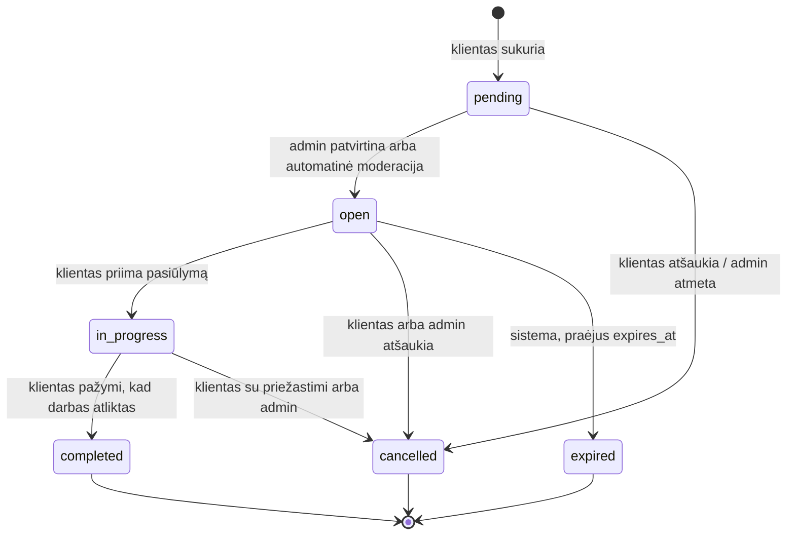
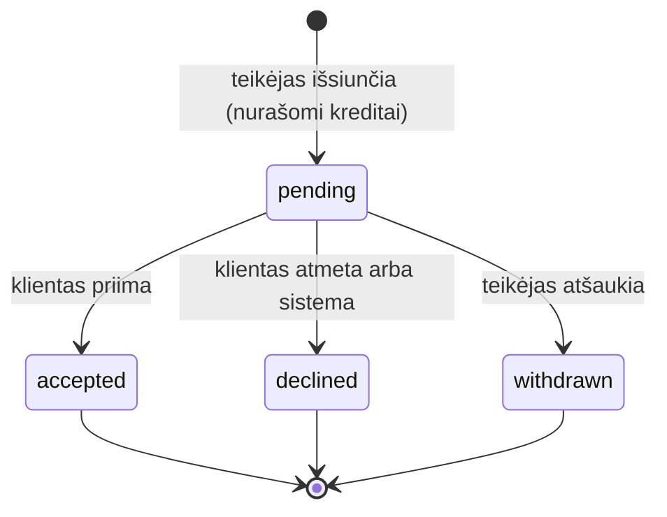

# Būsenų mašinos: užklausa ir pasiūlymas

> **Etapas 0 · projektas.** Kode tai įgyvendinsim Etape 5.

**Kas yra būsenų mašina (state machine).** Tai aiškiai aprašyta taisyklė: iš kurios būsenos į kurią galima
pereiti, kas tą perėjimą inicijuoja ir kas tuo metu dar turi įvykti (kreditai, pranešimai, skaitliukai).

**Kodėl jos reikia.** Be jos statusą būtų galima pakeisti bet kurioje kodo vietoje į bet ką, pvz. `completed` → `open`.
Tada atsiranda nelogiški duomenys: atsiliepimas neatliktam darbui, dvigubai nurašyti kreditai.

**Kaip įgyvendinsim (Etapas 5):**
- enum'e bus metodas `canTransitionTo(self $to): bool`, kuris pasakys, ar perėjimas leidžiamas;
- kiekvienas perėjimas bus atskira Action klasė (`AcceptOffer`, `CancelServiceRequest`, `ExpireServiceRequests`…),
  vykdoma `DB::transaction()` viduje, kad visos pasekmės įvyktų kartu arba neįvyktų visai;
- kas gali atlikti perėjimą, tikrins Policy.

*Alternatyva:* paketas `spatie/laravel-model-states`, kuriame kiekviena būsena ir perėjimas yra atskira klasė.
Jis galingas, bet mūsų 6 + 4 būsenoms per sudėtingas. Enum metodas + Action klasės yra paprasčiau ir aiškiau.
→ https://laravel.com/docs/12.x/eloquent-mutators#enum-casting · https://laravel.com/docs/12.x/database#database-transactions

---

## 1. Užklausa (`ServiceRequestStatus`)

| Iš | Į | Kas inicijuoja | Sąlyga | Pasekmės |
|---|---|---|---|---|
| (nauja) | `pending` | klientas | forma užpildyta ir validacija praėjo | – |
| `pending` | `open` | admin arba automatinė moderacija | turinys tinkamas | `published_at = now`, `expires_at = +30 d.`; job'as pranešia tinkamiems teikėjams |
| `pending` | `cancelled` | klientas (atšaukia) arba admin (atmeta) | – | `cancelled_at` |
| `open` | `in_progress` | klientas | priimamas vienas `pending` pasiūlymas | `accepted_offer_id`; tas pasiūlymas tampa `accepted`, kiti `pending` – `declined` (jiems pranešama); išrinktam teikėjui atskleidžiamas adresas ir telefonas |
| `open` | `cancelled` | klientas arba admin | – | `cancelled_at`; visi `pending` pasiūlymai tampa `declined`, **kreditai grąžinami** |
| `open` | `expired` | sistema (Scheduler kas valandą) | `expires_at` praėjo, niekas nepriimta | `pending` pasiūlymai tampa `declined`; kreditai grąžinami tik už tuos, kurių klientas **neatidarė** (`viewed_at IS NULL`) |
| `in_progress` | `completed` | klientas | – | `completed_at`; teikėjo `completed_jobs_count + 1`; klientui siunčiamas kvietimas palikti atsiliepimą |
| `in_progress` | `cancelled` | klientas (su priežastimi, pvz. teikėjas neatvyko) arba admin | – | `cancelled_at`; priimtas pasiūlymas lieka `accepted` (istorijai); kreditai negrąžinami |

**Galutinės būsenos:** `completed`, `cancelled`, `expired`. Iš jų niekur nepereinama.

Papildomos taisyklės:
- Pažymėti „Darbas atliktas" gali **tik klientas**. Teikėjas gali tik paprašyti, ir klientui nusiunčiamas
  priminimas. Taip atsiliepimas visada atsiranda tik po kliento patvirtinimo.
- Jei užklausa `in_progress` būsenoje stovi 60 d., klientui siunčiamas priminimas. Automatiškai jos neužbaigiam,
  kad nebūtų kvietimų vertinti darbus, kurie galbūt neįvyko.

---

## 2. Pasiūlymas (`OfferStatus`)

| Iš | Į | Kas inicijuoja | Sąlyga | Pasekmės |
|---|---|---|---|---|
| (naujas) | `pending` | teikėjas | užklausa `open`; teikėjas tinka (kategorija su tėvais, zona arba „visa Lietuva", profilis `active`); šiai užklausai dar nesiuntė; kreditų pakanka | nurašomi kreditai (ledger įrašas `offer`), `credits_spent` įsimenamas, `offers_count + 1`, klientui pranešama |
| `pending` | `accepted` | klientas | užklausa `open` | žr. užklausos `open → in_progress` |
| `pending` | `declined` | klientas (atmeta) arba sistema (priimtas kitas, užklausa atšaukta ar pasibaigė) | – | `responded_at` (tik kai atmetė klientas); dėl kreditų žr. 3 sk. |
| `pending` | `withdrawn` | teikėjas | užklausa dar `open` | `offers_count − 1`; **kreditai negrąžinami** |

**Galutinės būsenos:** `accepted`, `declined`, `withdrawn`.

**Kodėl „peržiūrėtas" nėra būsena.** `viewed_at` yra laiko žyma, o ne statusas. Pasiūlymas gali būti „laukiantis ir
peržiūrėtas" arba „atmestas ir peržiūrėtas". Jei `viewed` būtų atskira būsena, ji maišytųsi su kitomis ir
reikėtų dvigubai daugiau perėjimų.

---

## 3. Kreditų grąžinimo taisyklės

| Situacija | Grąžinama? | Kodėl |
|---|---|---|
| Klientas arba admin atšaukė **atvirą** užklausą | taip, už visus `pending` pasiūlymus | teikėjas neturėjo galimybės laimėti |
| Užklausa pasibaigė, o klientas pasiūlymo **neatidarė** | taip | ta pati priežastis |
| Užklausa pasibaigė, klientas pasiūlymą atidarė, bet nepasirinko | ne | teikėjas gavo galimybę |
| Klientas atmetė pasiūlymą | ne | tai įprasta konkurencija |
| Teikėjas pats atšaukė savo pasiūlymą | ne | kitaip būtų galima siųsti ir atšaukti nemokamai |
| Užklausa atšaukta jau `in_progress` būsenoje | ne | teikėjas darbą jau laimėjo |

Grąžinimas = naujas `credit_transactions` įrašas su `type = refund` ir `source` = pasiūlymas. Senas įrašas
nekeičiamas (ledger taisyklė, `DB_SCHEMA.md` 2.8). Tai verslo taisyklės, ne techniniai apribojimai: jas galima
keisti, ir pasikeistų tik Action klasių logika, ne DB schema.
