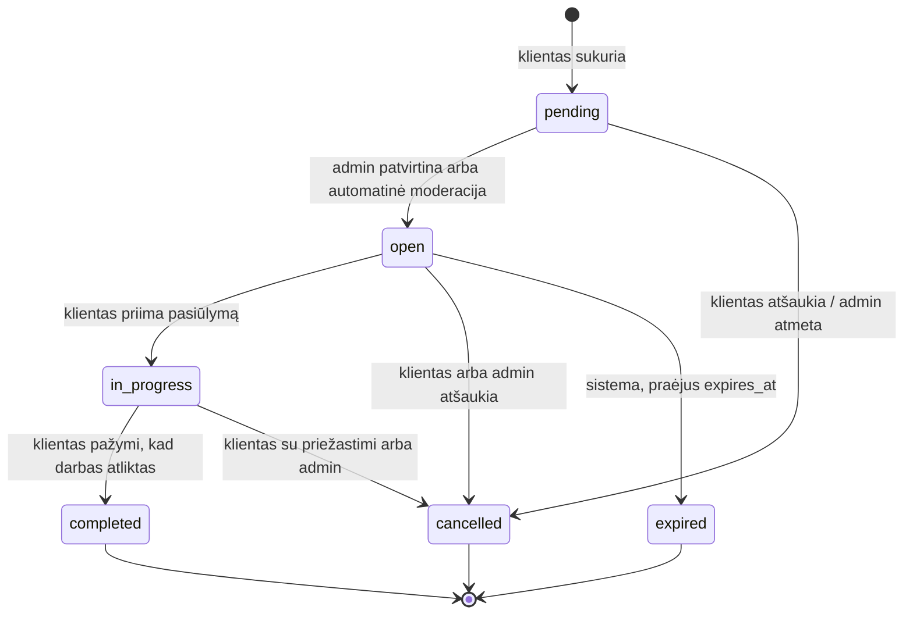
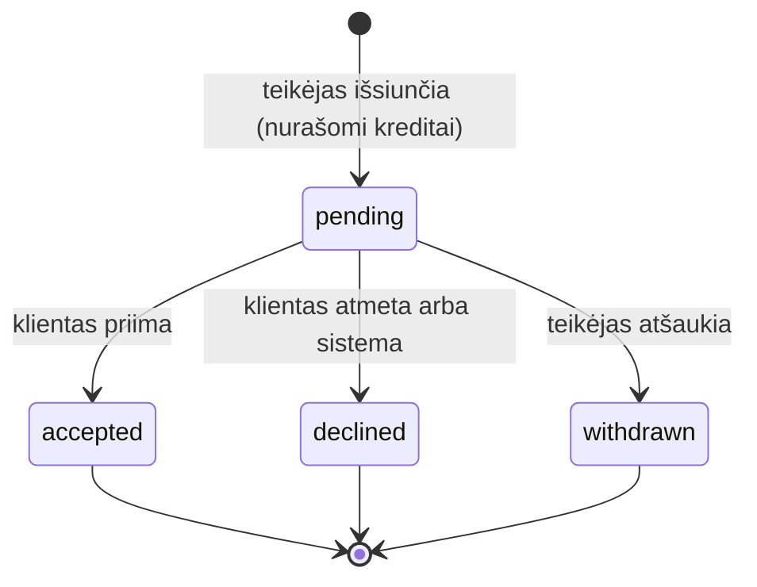

# Būsenų mašinos: užklausa ir pasiūlymas

> **Etapas 0 · projektas, įgyvendinta Etape 5.** Kur kas yra kode – [4 skyrius](#4-įgyvendinimas-kode-etapas-5).

**Kas yra būsenų mašina (state machine).** Tai aiškiai aprašyta taisyklė: iš kurios būsenos į kurią galima
pereiti, kas tą perėjimą inicijuoja ir kas tuo metu dar turi įvykti (kreditai, pranešimai, skaitliukai).

**Kodėl jos reikia.** Be jos statusą būtų galima pakeisti bet kurioje kodo vietoje į bet ką, pvz. `completed` → `open`.
Tada atsiranda nelogiški duomenys: atsiliepimas neatliktam darbui, dvigubai nurašyti kreditai.

**Kaip įgyvendinsim (Etapas 5):**

- enum'e bus metodas `canTransitionTo(self $to): bool`, kuris pasakys, ar perėjimas leidžiamas;
- kiekvienas perėjimas bus atskira Action klasė (`AcceptOffer`, `CancelServiceRequest`, `ExpireServiceRequests`…),
  vykdoma `DB::transaction()` viduje, kad visos pasekmės įvyktų kartu arba neįvyktų visai;
- kas gali atlikti perėjimą, tikrins Policy.

_Alternatyva:_ paketas `spatie/laravel-model-states`, kuriame kiekviena būsena ir perėjimas yra atskira klasė.
Jis galingas, bet mūsų 6 + 4 būsenoms per sudėtingas. Enum metodas + Action klasės yra paprasčiau ir aiškiau.
→ https://laravel.com/docs/13.x/eloquent-mutators#enum-casting · https://laravel.com/docs/13.x/database#database-transactions

---

## 1. Užklausa (`ServiceRequestStatus`)

| Iš            | Į             | Kas inicijuoja                                               | Sąlyga                                | Pasekmės                                                                                                                                                    |
| ------------- | ------------- | ------------------------------------------------------------ | ------------------------------------- | ----------------------------------------------------------------------------------------------------------------------------------------------------------- |
| (nauja)       | `pending`     | klientas                                                     | forma užpildyta ir validacija praėjo  | –                                                                                                                                                           |
| `pending`     | `open`        | admin arba automatinė moderacija                             | turinys tinkamas                      | `published_at = now`, `expires_at = +30 d.`; job'as pranešia tinkamiems teikėjams                                                                           |
| `pending`     | `cancelled`   | klientas (atšaukia) arba admin (atmeta)                      | –                                     | `cancelled_at`                                                                                                                                              |
| `open`        | `in_progress` | klientas                                                     | priimamas vienas `pending` pasiūlymas | `accepted_offer_id`; tas pasiūlymas tampa `accepted`, kiti `pending` – `declined` (jiems pranešama); išrinktam teikėjui atskleidžiamas adresas ir telefonas |
| `open`        | `cancelled`   | klientas arba admin                                          | –                                     | `cancelled_at`; visi `pending` pasiūlymai tampa `declined`, **kreditai grąžinami**                                                                          |
| `open`        | `expired`     | sistema (Scheduler kas valandą)                              | `expires_at` praėjo, niekas nepriimta | `pending` pasiūlymai tampa `declined`; kreditai grąžinami tik už tuos, kurių klientas **neatidarė** (`viewed_at IS NULL`)                                   |
| `in_progress` | `completed`   | klientas                                                     | –                                     | `completed_at`; teikėjo `completed_jobs_count + 1`; klientui siunčiamas kvietimas palikti atsiliepimą                                                       |
| `in_progress` | `cancelled`   | klientas (su priežastimi, pvz. teikėjas neatvyko) arba admin | –                                     | `cancelled_at`; priimtas pasiūlymas lieka `accepted` (istorijai); kreditai negrąžinami                                                                      |

**Galutinės būsenos:** `completed`, `cancelled`, `expired`. Iš jų niekur nepereinama.

Papildomos taisyklės:

- Pažymėti „Darbas atliktas" gali **tik klientas**. Teikėjas gali tik paprašyti, ir klientui nusiunčiamas
  priminimas. Taip atsiliepimas visada atsiranda tik po kliento patvirtinimo.
- Jei užklausa `in_progress` būsenoje stovi 60 d., klientui siunčiamas priminimas. Automatiškai jos neužbaigiam,
  kad nebūtų kvietimų vertinti darbus, kurie galbūt neįvyko.

**Įgyvendinta Etape 6:**

- Teikėjo prašymas – `RequestCompletion` (Policy `ServiceRequestPolicy::requestCompletion`: tik išrinktas teikėjas,
  užklausa `in_progress`). Kartoti galima ne dažniau kaip kas 3 d. – riba saugoma stulpelyje
  `service_requests.completion_requested_at` (ne cache: išlieka ir rodoma puslapyje „Paskutinį kartą prašėte…").
  Klientui – `CompletionRequested`, o užklausos puslapyje – priminimas prie „Darbas atliktas".
- 60 d. priminimas – kasdienė komanda `service-requests:remind-completion` (9:00 Lietuvos laiku), Action
  `SendCompletionReminder`. „Vykdoma nuo" = priimto pasiūlymo `responded_at`. Siunčiama **vieną kartą**
  (`completion_reminded_at`), klientui – `CompletionReminder`.
- Užbaigus darbą (`CompleteServiceRequest`) klientas gauna `ReviewInvitation` ir per 60 d. gali palikti vieną
  patvirtintą atsiliepimą.

---

## 2. Pasiūlymas (`OfferStatus`)

| Iš        | Į           | Kas inicijuoja                                                                  | Sąlyga                                                                                                                                            | Pasekmės                                                                                                      |
| --------- | ----------- | ------------------------------------------------------------------------------- | ------------------------------------------------------------------------------------------------------------------------------------------------- | ------------------------------------------------------------------------------------------------------------- |
| (naujas)  | `pending`   | teikėjas                                                                        | užklausa `open`; teikėjas tinka (kategorija su tėvais, zona arba „visa Lietuva", profilis `active`); šiai užklausai dar nesiuntė; kreditų pakanka | nurašomi kreditai (ledger įrašas `offer`), `credits_spent` įsimenamas, `offers_count + 1`, klientui pranešama |
| `pending` | `accepted`  | klientas                                                                        | užklausa `open`                                                                                                                                   | žr. užklausos `open → in_progress`                                                                            |
| `pending` | `declined`  | klientas (atmeta) arba sistema (priimtas kitas, užklausa atšaukta ar pasibaigė) | –                                                                                                                                                 | `responded_at` (tik kai atmetė klientas); dėl kreditų žr. 3 sk.                                               |
| `pending` | `withdrawn` | teikėjas                                                                        | užklausa dar `open`                                                                                                                               | `offers_count − 1`; **kreditai negrąžinami**                                                                  |

**Galutinės būsenos:** `accepted`, `declined`, `withdrawn`.

**Kodėl „peržiūrėtas" nėra būsena.** `viewed_at` yra laiko žyma, o ne statusas. Pasiūlymas gali būti „laukiantis ir
peržiūrėtas" arba „atmestas ir peržiūrėtas". Jei `viewed` būtų atskira būsena, ji maišytųsi su kitomis ir
reikėtų dvigubai daugiau perėjimų.

---

## 3. Kreditų grąžinimo taisyklės

| Situacija                                                       | Grąžinama?                          | Kodėl                                           |
| --------------------------------------------------------------- | ----------------------------------- | ----------------------------------------------- |
| Klientas arba admin atšaukė **atvirą** užklausą                 | taip, už visus `pending` pasiūlymus | teikėjas neturėjo galimybės laimėti             |
| Užklausa pasibaigė, o klientas pasiūlymo **neatidarė**          | taip                                | ta pati priežastis                              |
| Užklausa pasibaigė, klientas pasiūlymą atidarė, bet nepasirinko | ne                                  | teikėjas gavo galimybę                          |
| Klientas atmetė pasiūlymą                                       | ne                                  | tai įprasta konkurencija                        |
| Teikėjas pats atšaukė savo pasiūlymą                            | ne                                  | kitaip būtų galima siųsti ir atšaukti nemokamai |
| Užklausa atšaukta jau `in_progress` būsenoje                    | ne                                  | teikėjas darbą jau laimėjo                      |

Grąžinimas = naujas `credit_transactions` įrašas su `type = refund` ir `source` = pasiūlymas. Senas įrašas
nekeičiamas (ledger taisyklė, `DB_SCHEMA.md` 2.8). Tai verslo taisyklės, ne techniniai apribojimai: jas galima
keisti, ir pasikeistų tik Action klasių logika, ne DB schema.

---

## 4. Įgyvendinimas kode (Etapas 5)

**Būsenų mašina** – `App\Enums\ServiceRequestStatus` ir `App\Enums\OfferStatus`: `allowedTransitions()`,
`canTransitionTo()`, `isFinal()`. Tai vienintelė vieta, kur surašyti leidžiami perėjimai.

**Kiekvienas perėjimas – Action klasė** (`app/Actions`), vykdoma `DB::transaction()` viduje:

| Perėjimas                                    | Action                                   | Kas gali (Policy)                                          | Pranešimai                                                                                                           |
| -------------------------------------------- | ---------------------------------------- | ---------------------------------------------------------- | -------------------------------------------------------------------------------------------------------------------- |
| (nauja) → `pending` → `open`                 | `CreateServiceRequest` + `AutoModerator` | `ServiceRequestPolicy::create` (klientas)                  | tinkamiems teikėjams `NewMatchingRequest` (job'as `NotifyMatchingProviders`)                                         |
| `pending` → `open`                           | `PublishServiceRequest`                  | `publish` (admin, Filament)                                | klientui `ServiceRequestPublished` + teikėjams                                                                       |
| `pending`/`open`/`in_progress` → `cancelled` | `CancelServiceRequest`                   | `cancel` (savininkas arba admin)                           | `OfferDeclined` (su grąžintais kreditais), `ServiceRequestCancelled`, admin atveju klientui `ServiceRequestRejected` |
| `open` → `in_progress`                       | `AcceptOffer`                            | `OfferPolicy::accept` (užklausos klientas)                 | `OfferAccepted` išrinktajam, `OfferDeclined` kitiems                                                                 |
| `open` → `expired`                           | `ExpireServiceRequest`                   | sistema: `php artisan service-requests:expire` kas valandą | `OfferDeclined` (grąžinta tik už neatidarytus)                                                                       |
| `in_progress` → `completed`                  | `CompleteServiceRequest`                 | `complete` (tik klientas)                                  | klientui `ReviewInvitation` (Etapas 6)                                                                               |
| `completion_requested_at` (ne būsena)        | `RequestCompletion`                      | `requestCompletion` (išrinktas teikėjas, kas 3 d.)         | klientui `CompletionRequested` (Etapas 6)                                                                            |
| `completion_reminded_at` (ne būsena)         | `SendCompletionReminder`                 | sistema: `service-requests:remind-completion` kasdien      | klientui `CompletionReminder`, vieną kartą po 60 d. (Etapas 6)                                                       |
| (naujas) → `pending` pasiūlymas              | `SendOffer`                              | `OfferPolicy::create` (tinkamas aktyvus teikėjas)          | klientui `NewOffer`                                                                                                  |
| `pending` → `declined`                       | `DeclineOffer`                           | `decline` (užklausos klientas)                             | teikėjui `OfferDeclined`                                                                                             |
| `pending` → `withdrawn`                      | `WithdrawOffer`                          | `withdraw` (pasiūlymo autorius)                            | –                                                                                                                    |
| `viewed_at` (ne būsena)                      | `MarkOfferViewed`                        | klientas atidaro pasiūlymo puslapį                         | –                                                                                                                    |

**Policy ir Action dalijasi darbą.** Policy atsako „ar šis žmogus gali" ir pagal ją UI rodo tik galimus mygtukus.
Action, užrakinusi eilutes (`lockForUpdate()`), būseną patikrina dar kartą: tarp puslapio atidarymo ir paspaudimo
ji galėjo pasikeisti. Tada metama `InvalidStateTransitionException`, kuri vartotojui grąžinama kaip klaidos
pranešimas (toast), o ne 500 klaida.

**Užraktų tvarka visada ta pati:** pirma užklausos eilutė, tada pasiūlymai, tada teikėjų eilutės (didėjančia ID
tvarka). Jei viena operacija rakintų A → B, o kita B → A, MySQL abi sustabdytų (deadlock) ir vieną atšauktų.

**Kreditai** keičiami tik per `App\Services\Credits\CreditLedger` (`debit`, `credit`, `refund`). `refund($offer)`
grąžina grynąją ledger sumą už tą šaltinį, todėl yra idempotentiškas: antras kvietimas nieko nebegrąžina.

**Atitikimo taisyklė** („kuris teikėjas tinka kuriai užklausai") – `App\Services\Matching\ProviderMatcher`.
Ją naudoja pranešimai, teikėjo srautas, Policy ir `SendOffer`.
